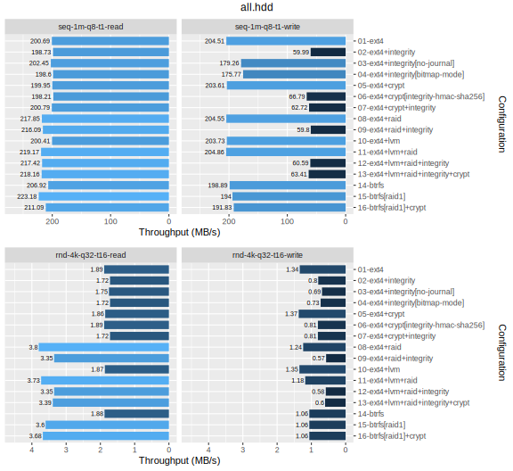
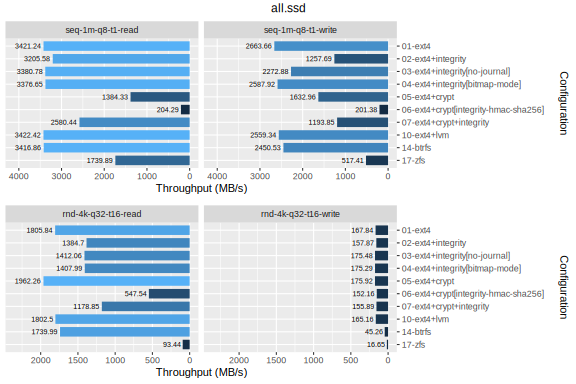
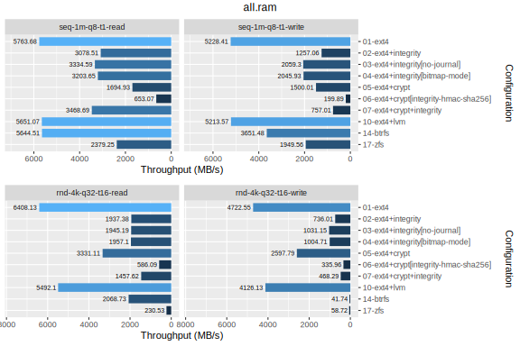
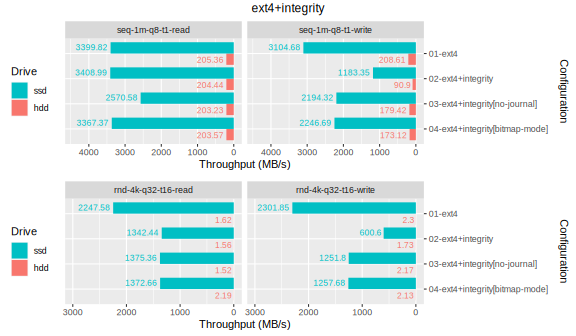
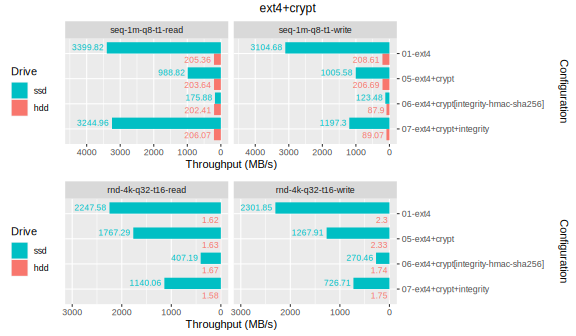
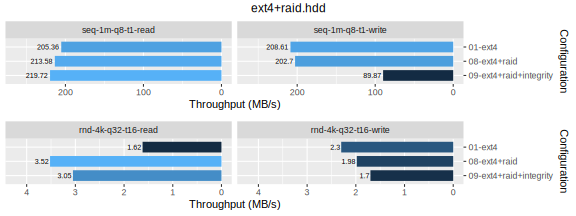
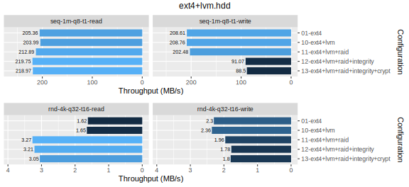
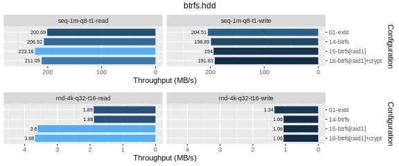
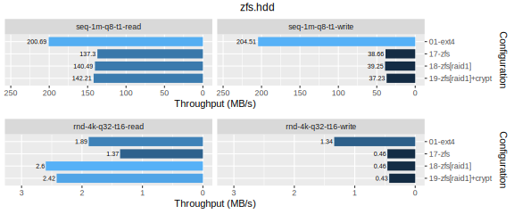
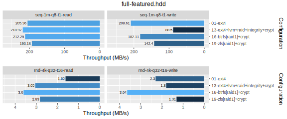

# dm-integrity Benchmarks

Measure dm-integrity IO performance using Fio.

This research is a personal project for summer vacation 2023. 🌞

## Introduction

No one wants to lose their data. However, gigantic cloud providers ruthlessly close your account one day and do not respond to your complaint. Or, like many cloud storage services that were popular for a while, the next thing you know, that service has already shut down and gone with the data. So, everyone should have their own storage to prepare for the coming day.

### Silent data corruption

Linux offers a variety of options to meet our needs. We can build a RAID for redundancy and make consistent backups from LVM snapshots. Our and our families' data is safe. Is it true? dm-raid, the software RAID implemented in Linux kernel, can detect bad sectors and repair them, but cannot correct bad data in good sectors occured by some reason. If left as is, the correct backup could be overwritten with bad data. Just thinking of it is scary.

This phenomenon is called [silent data corruption](https://en.wikipedia.org/wiki/Data_corruption#Silent) (as known as **bit rot**). It is caused by incomplete insulation, high temperature environment, cosmic radiation impact, etc. Although the probability is low, it is a non-negligible cause of failure for me who wants to maintain data reliably over the long term.

### Solution candidates

[dm-integrity](https://docs.kernel.org/admin-guide/device-mapper/dm-integrity.html) is a Linux device mapper that provides per-block integrity checking. When dm-integrity detects bad data, it is detected by dm-raid as a bad sector. This allows dm-raid to detect bad data and repair it by rebuilding the disk array. In addition, dm-integrity provides tamper detection when combined with [dm-crypt](https://docs.kernel.org/admin-guide/device-mapper/dm-crypt.html). However, this feature is still experimental. In any case, you can choose any top-level file system you like. Many people may choose [ext4](https://www.kernel.org/doc/html/latest/filesystems/ext4/), but it can be anything else.

Some filesystems have data correction capability (called **scrubbing**) by themselves. On Linux, [btrfs](https://docs.kernel.org/filesystems/btrfs.html) and [OpenZFS](https://github.com/openzfs/zfs) (the Linux port of ZFS) are the most common. They have RAID and snapshot capabilities and are expected to be simpler to configure and faster than a combination of device mappers. However, btrfs has long been said to have problems about stability and performance. On the other hand, ZFS will not be merged into the Linux kernel due to licensing issues.

### Finding the best configuration for long term storage

This study will list several storage configurations that are easy to deploy at home and measure their IO performance (primarily throughput). Because I could not find an detailed performance comparison during normal operation. That's why I started this research. Please refer to other studies for the reliability of each configuration. The following article should be most referenced for reliability.

- [Battle testing ZFS, Btrfs and mdadm+dm-integrity](https://www.unixsheikh.com/articles/battle-testing-zfs-btrfs-and-mdadm-dm.html)

## Methodology

### Test drives

In this study, I use Lenovo ThinkStation P500 workstation. It was a bit old, but a great bargain that sold for ¥30,000 in 2020. Additional storages are much more expensive.

| Component       | Description                                     | Test drive          |
| --------------- | ----------------------------------------------- | ------------------- |
| CPU             | 4 Core 8 Threads (Intel Xeon E5-1620 v3)        | -                   |
| **RAM**         | **48 GB DDR4 ECC RDIMM**                        | ✅ (`/dev/ram0`)    |
| SATA SSD #1     | 500 GB SATA SSD (Trancend SSD370 TS512GSSD370S) | ❌                  |
| **SATA HDD #1** | **12 TB SATA HDD (WD Red Plus WD120EFBX)**      | ✅ (`/dev/sdb`)     |
| **SATA HDD #2** | **12 TB SATA HDD (WD Red Plus WD120EFBX)**      | ✅ (`/dev/sdc`)     |
| SATA HDD #3     | 12 TB SATA HDD (WD Red Plus WD120EFBX)          | ❌                  |
| SATA HDD #4     | 12 TB SATA HDD (WD Red Plus WD120EFBX)          | ❌                  |
| **NVMe SSD #1** | **1 TB NVMe SSD (WD Red SN700)**                | ✅ (`/dev/nvme0n1`) |
| OS              | Linux 6.1.0 (Debian 12.1 Bookworm)              | -                   |

Install additional packages.

```sh
$ sudo apt install zfs-dkms zfsutils-linux
...
```

The versions of the package are as follows.

```sh
$ apt list --installed 2>/dev/null | grep -E '^(btrfs-progs|cryptsetup-bin|lvm2|mdadm|zfs*)/'
btrfs-progs/stable,now 6.2-1 amd64 [installed,automatic]
cryptsetup-bin/stable,now 2:2.6.1-4~deb12u1 amd64 [installed,automatic]
lvm2/stable,now 2.03.16-2 amd64 [installed,automatic]
mdadm/stable,now 4.2-5 amd64 [installed,automatic]
zfs-dkms/stable,now 2.1.11-1 all [installed]
zfs-zed/stable,now 2.1.11-1 amd64 [installed,automatic]
zfsutils-linux/stable,now 2.1.11-1 amd64 [installed]
```

Disable write cache for SATA HDD \#1~2.

```sh
$ sudo hdparm -W0 /dev/{sdb,sdc}

/dev/sdb:
 setting drive write-caching to 0 (off)
 write-caching =  0 (off)

/dev/sdc:
 setting drive write-caching to 0 (off)
 write-caching =  0 (off)
```

Set IO scheduler to `none` for SATA HDD \#1~2.

```sh
$ echo none | sudo tee /sys/block/{sdb,sdc}/queue/scheduler
none
$ cat /sys/block/{sdb,sdc,nvme0n1,ram0}/queue/scheduler
[none] mq-deadline
[none] mq-deadline
[none] mq-deadline
none
```

For saving time, create small partitions on SATA HDD \#1~2 and NVMe SSD \#1. Also create a RAM drive.

```sh
$ sudo fdisk /dev/sdb
...
$ sudo fdisk /dev/sdc
...
$ sudo fdisk /dev/nvme0n1
...
$ sudo modprobe brd rd_nr=1 rd_size=8388608
...
```

All drives are ready.

```sh
$ sudo fdisk -l /dev/{sdb,sdc,nvme0n1,ram0}
Disk /dev/sdb: 10.91 TiB, 12000138625024 bytes, 23437770752 sectors
Disk model: WDC WD120EFBX-68
Units: sectors of 1 * 512 = 512 bytes
Sector size (logical/physical): 512 bytes / 4096 bytes
I/O size (minimum/optimal): 4096 bytes / 4096 bytes
Disklabel type: gpt
Disk identifier: E0E7AD31-257B-644E-9741-F36E908EE3F5

Device     Start      End  Sectors Size Type
/dev/sdb1   2048 16779263 16777216   8G Linux filesystem


Disk /dev/sdc: 10.91 TiB, 12000138625024 bytes, 23437770752 sectors
Disk model: WDC WD120EFBX-68
Units: sectors of 1 * 512 = 512 bytes
Sector size (logical/physical): 512 bytes / 4096 bytes
I/O size (minimum/optimal): 4096 bytes / 4096 bytes
Disklabel type: gpt
Disk identifier: E291F514-A310-0649-A398-42A8DF431E0E

Device     Start      End  Sectors Size Type
/dev/sdc1   2048 16779263 16777216   8G Linux filesystem


Disk /dev/nvme0n1: 931.51 GiB, 1000204886016 bytes, 1953525168 sectors
Disk model: WD Red SN700 1000GB
Units: sectors of 1 * 512 = 512 bytes
Sector size (logical/physical): 512 bytes / 512 bytes
I/O size (minimum/optimal): 512 bytes / 512 bytes
Disklabel type: gpt
Disk identifier: 62F63BAD-C4BF-2844-B214-2A8A6EF6C397

Device         Start      End  Sectors Size Type
/dev/nvme0n1p1  2048 16779263 16777216   8G Linux filesystem


Disk /dev/ram0: 8 GiB, 8589934592 bytes, 16777216 sectors
Units: sectors of 1 * 512 = 512 bytes
Sector size (logical/physical): 512 bytes / 4096 bytes
I/O size (minimum/optimal): 4096 bytes / 4096 bytes
```

### Test configurations

The following are candidate configurations suitable for long-term storage combined filesystems widely used in Linux.

| #   | Configuration                                               | Encryption | Redundancy | Scrubbing | Snapshot |
| --- | ----------------------------------------------------------- | ---------- | ---------- | --------- | -------- |
| 1   | ext4                                                        | ❌         | ❌         | ❌        | ❌       |
| 2   | ext4 on dm-integrity                                        | ❌         | ❌         | ❌        | ❌       |
| 3   | ext4 on dm-integrity (no journal)                           | ❌         | ❌         | ❌        | ❌       |
| 4   | ext4 on dm-integrity (bitmap mode)                          | ❌         | ❌         | ❌        | ❌       |
| 5   | ext4 on dm-crypt                                            | ✅         | ❌         | ❌        | ❌       |
| 6   | ext4 on dm-crypt (with `--integrity=hmac-sha256`)           | ✅         | ❌         | ❌        | ❌       |
| 7   | ext4 on dm-crypt on dm-integrity                            | ✅         | ❌         | ❌        | ❌       |
| 8   | ext4 on dm-raid (RAID 1)                                    | ❌         | ✅         | ⚠️        | ❌       |
| 9   | ext4 on dm-raid (RAID 1) on dm-integrity                    | ❌         | ✅         | ✅        | ❌       |
| 10  | ext4 on LVM                                                 | ❌         | ❌         | ❌        | ✅       |
| 11  | ext4 on LVM on dm-raid (RAID 1)                             | ❌         | ✅         | ⚠️        | ✅       |
| 12  | ext4 on LVM on dm-raid (RAID 1) on dm-integrity             | ❌         | ✅         | ✅        | ✅       |
| 13  | ext4 on LVM on dm-raid (RAID 1) on dm-integrity on dm-crypt | ✅         | ✅         | ✅        | ✅       |
| 14  | btrfs                                                       | ❌         | ❌         | ✅        | ✅       |
| 15  | btrfs (RAID 1)                                              | ❌         | ✅         | ✅        | ✅       |
| 16  | btrfs (RAID 1) on dm-crypt                                  | ✅         | ✅         | ✅        | ✅       |
| 17  | ZFS                                                         | ❌         | ❌         | ✅        | ✅       |
| 18  | ZFS (RAID 1)                                                | ❌         | ✅         | ✅        | ✅       |
| 19  | ZFS (RAID 1) on dm-crypt                                    | ✅         | ✅         | ✅        | ✅       |

⚠️...dm-raid cannot correct bad data (can only bad sectors).

#### \#1: ext4

ext4 is the most common filesystem in Linux. In this study, ext4 will be used as a benchmark against other configurations. The above list states that ext4 does not have encryption capability, but in fact, ext4 has per-file encryption capability using [fscrypt](https://www.kernel.org/doc/html/latest/filesystems/fscrypt.html). However, it is out of scope due to differences in granularity.

#### \#2~4: ext4 on dm-integrity

dm-integrity has three methods to guarantee write integrity (journal, no journal, and bitmap mode). By default, journal is enabled, which is the most reliable but slower. No-journal is not crash-tolerant, and bitmap mode is less reliable than journal. Since reliability is the primary concern in this study, the journal is used in combination with other device mappers. The default sector size for dm-integrity is 512 bytes. This is too small, so it should be increased to 4,096 bytes.

#### \#5~7: ext4 on dm-crypt

dm-crypt performance related parameters are tuned based on [the Cloudflare blog post](https://blog.cloudflare.com/speeding-up-linux-disk-encryption/). The default write interval is 10 seconds. I wanted to set it to 5 seconds to match the ext4 commit interval, but did not know how to change it. This may increase the apparent write performance by using dm-crypt. The default encryption algorithm is `aes-xts-plain64` and hardware acceleration would be available on many CPUs.

There is a special combination of dm-crypt and dm-integrity (**\#6**). It is capable of both encryption and tamper detection using HMAC. However, the hash function used in HMAC (usually SHA-256) is not hardware-accelerated and strongly depends on CPU performance. Furthermore, TRIM on SSDs is not available for security reason. This configuration is considered experimental and is only for reference in this study.

#### \#8~9: ext4 on dm-raid

dm-raid can be built on top of dm-integrity as described in the introduction to detect and correct silent data corruption. In this study, the RAID level is RAID 1 because two HDDs are used. Since there is only one SSD and one RAM drive, RAID performance is not measured.

#### \#10~13: ext4 on LVM

LVM can be combined with dm-raid and dm-integrity to have capabilities similar to btrfs and ZFS described below. LVM has also `lvraid` command to build RAID on LV, but RAID configuration is out of scope in this study.

#### \#14~16: btrfs

btrfs commit interval is longer than other filesystems (30 seconds for btrfs, 5 seconds for both ext4 and ZFS). To be fair, set it to 5 seconds.

#### \#17~19: ZFS

ZFS actively uses RAM as a cache. I measured the throughput beforehand, and it was as fast as a RAM disk even with HDD. However, this is not a realistic scenario for long-term storage. Therefore, only metadata is cached in the test configuration.

### Data collection

Measure the following throughput performance for each drive and configuration using [fio](https://github.com/axboe/fio). Parameters are based on [CrystalDiskMark](https://crystalmark.info/en/category/crystaldiskmark/)'s "[Peak Performance](https://crystalmark.info/en/software/crystaldiskmark/crystaldiskmark-main-menu/)" profile and [the Nutanix knowledge base](https://portal.nutanix.com/page/documents/kbs/details?targetId=kA07V000000LX7xSAG).

| Test                   | Read/Write       | Block Size | Queue Size | Threads |
| ---------------------- | ---------------- | ---------- | ---------- | ------- |
| `seq-1m-q8-t1-read`    | Sequential Read  | 1 MiB      | 8          | 1       |
| `seq-1m-q8-t1-write`   | Sequential Write | 1 MiB      | 8          | 1       |
| `rnd-4k-q32-t16-read`  | Random Read      | 4 kiB      | 32         | 16      |
| `rnd-4k-q32-t16-write` | Random Write     | 4 kiB      | 32         | 16      |

See `tools/test.fio` for details.

Install additional packages.

```

$ sudo apt install fio make

```

Run all tests.

```sh
$ export HDD1_DEV=/dev/sdb1 # WARNING: Change to your environment.
$ export HDD2_DEV=/dev/sdc1 # WARNING: Change to your environment.
$ export SSD1_DEV=/dev/nvme0n1p1 # WARNING: Change to your environment.
$ export RAM1_DEV=/dev/ram0 # WARNING: Change to your environment.
$ make test
...
```

### Data analysis

Nothing special. All I do is plot the throughput per test result on a bar chart using [R](https://www.r-project.org/).

Install additional packages.

```sh
$ sudo apt install jq r-base r-cran-dplyr r-cran-ggplot2 r-cran-gridextra
```

Generate CSV and SVG from JSON of test results.

```sh
$ make report
...
```

For details, see `out.sample/` directory.

## Results & discussion

### SATA HDD #1~2



(TODO)

### NVMe SSD #1



(TODO)

### RAM



(TODO)

### ext4 vs dm-integrity



(TODO)

### ext4 vs dm-crypt



(TODO)

### ext4 vs dm-raid



(TODO)

### ext4 vs LVM



(TODO)

### ext4 vs btrfs



(TODO)

### ext4 vs ZFS



(TODO)

### ext4 vs the full-featured configurations



(TODO)

## Conclusion

(TODO)
