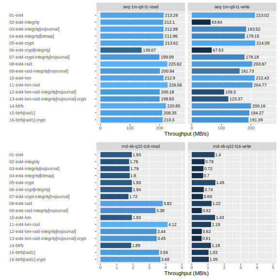

# `dm-integrity` Benchmarks

Measure `dm-integrity` IO performance using Fio.

This research is a personal project for 2023 summer vacation. 🌞

## Introduction

No one wants to lose their data. However, gigantic cloud providers ruthlessly close your account one day and do not respond to your complaint. Or, like many cloud storage services that were popular for a while, the next thing you know, that service has already shut down and is gone with the data. Everyone should have their own storage, to prepare for the coming days. Linux offers a variety of options to meet your needs.

### Silent data corruption

Build a RAID for redundancy and make backup from LVM snapshot consistency. My and my family's data are safe. Is it true? `dm-raid`, the software RAID implemented in Linux kernel, can detect bad sectors and repair them, but can not correct bad data occured in good sectors by some reason. If left as is, the correct backup will be overwritten with bad data. Just thinking of it is scary.

This phenomenon is called [data degredation](https://en.wikipedia.org/wiki/Data_degradation) (as known as **bit rot**). It is caused by incomplete insulation, high temperature environment, cosmic radiation impact, etc. Although the probability is low, it is considered a non-negligible cause of failure for me who wants to maintain data reliably over the long term.

### Finding the best configuration for long term storage

(TODO)


## Methodology

(TODO)

### Cases

(TODO)

| #   | Description                                                                      | Encryption | Redundancy | Scrubbing | Snapshot |
| --- | -------------------------------------------------------------------------------- | ---------- | ---------- | --------- | -------- |
| 1   | `ext4`                                                                           | ❌         | ❌         | ❌        | ❌       |
| 2   | `ext4` on `dm-integrity`                                                         | ❌         | ❌         | ❌        | ❌       |
| 3   | `ext4` on `dm-integrity` (no journal)                                            | ❌         | ❌         | ❌        | ❌       |
| 4   | `ext4` on `dm-integrity` (bitmap mode)                                           | ❌         | ❌         | ❌        | ❌       |
| 5   | `ext4` on `dm-crypt`                                                             | ✅         | ❌         | ❌        | ❌       |
| 6   | `ext4` on `dm-crypt` (with `--integrity` option)                                 | ✅         | ❌         | ❌        | ❌       |
| 7   | `ext4` on `dm-crypt` on `dm-integrity` (no-journal)                              | ✅         | ❌         | ❌        | ❌       |
| 8   | `ext4` on `dm-raid` (RAID 1)                                                     | ❌         | ✅         | ⚠️        | ❌       |
| 9   | `ext4` on `dm-raid` (RAID 1) on `dm-integrity` (no-journal)                      | ❌         | ✅         | ✅        | ❌       |
| 10  | `ext4` on LVM                                                                    | ❌         | ❌         | ❌        | ✅       |
| 11  | `ext4` on LVM on `dm-raid` (RAID 1)                                              | ❌         | ✅         | ⚠️        | ✅       |
| 12  | `ext4` on LVM on `dm-raid` (RAID 1) on `dm-integrity` (no-journal)               | ❌         | ✅         | ✅        | ✅       |
| 13  | `ext4` on LVM on `dm-raid` (RAID 1) on `dm-integrity` (no-journal) on `dm-crypt` | ✅         | ✅         | ✅        | ✅       |
| 14  | `btrfs`                                                                          | ❌         | ❌         | ✅        | ✅       |
| 15  | `btrfs` (RAID 1)                                                                 | ❌         | ✅         | ✅        | ✅       |
| 16  | `btrfs` (RAID 1) on `dm-crypt`                                                   | ✅         | ✅         | ✅        | ✅       |

⚠️...`dm-raid` cannot correct bad data (only bad sectors).

### Setup

In this study, I use Lenovo ThinkStation P500 workstation. It was a bit old, but a great bargain that sold for ¥30,000 in 2020.

| Component | Description           | Remark             |
| --------- | --------------------- | ------------------ |
| CPU       | Intel Xeon E5-1620 v3 | -                  |
| Memory    | 48 GiB DDR4 ECC RDIMM | -                  |
| Disk      | 500 GB SATA SSD       | -                  |
| Disk      | 12 TB SATA HDD        | **Target Disk #1** |
| Disk      | 12 TB SATA HDD        | **Target Disk #2** |
| OS        | Debian 12.1 Bookworm  | -                  |

Disable write cache on target disks (`/dev/sdb` and `/dev/sdc`).

```
$ sudo hdparm -W0 /dev/{sdb,sdc}

/dev/sdb:
 setting drive write-caching to 0 (off)
 write-caching =  0 (off)

/dev/sdc:
 setting drive write-caching to 0 (off)
 write-caching =  0 (off)
```

To save time, create small 1 GiB partitions (`/dev/sdb1` and `/dev/sdc1`) on target disks.

```
$ sudo fdisk /dev/sdb
...
$ sudo fdisk /dev/sdc
...
$ lsblk /dev/{sdb,sdc}
NAME   MAJ:MIN RM   SIZE RO TYPE MOUNTPOINTS
sdb      8:16   0  10.9T  0 disk
└─sdb1   8:17   0  1023M  0 part
sdc      8:32   0  10.9T  0 disk
└─sdc1   8:33   0  1023M  0 part
```

### Data collection

(TODO)

Install additional packages.

```
$ sudo apt install fio make
```

Test all cases for target disks.

```
$ export DISK1_DEV=/dev/sdb1 # WARNING: Change to your environment.
$ export DISK2_DEV=/dev/sdc1 # WARNING: Change to your environment.
$ make test
...
```

### Data analysis

(TODO)

Install additional packages.

```
$ sudo apt install jq r-base r-cran-dplyr r-cran-ggplot2 r-cran-gridextra
```

Generate the result.

```
$ make report
...
```

For details, see `gen/` directory.

## Results



(TODO)


## Conclusion

(TODO)

## References

- [dm-integrity — The Linux Kernel documentation](https://docs.kernel.org/admin-guide/device-mapper/dm-integrity.html)
- [GitHub - axboe/fio: Flexible I/O Tester](https://github.com/axboe/fio)
- [Performance benchmarking with Fio on Nutanix](https://portal.nutanix.com/page/documents/kbs/details?targetId=kA07V000000LX7xSAG)
- [Speeding up Linux disk encryption](https://blog.cloudflare.com/speeding-up-linux-disk-encryption/)
- [CrystalDiskMark - Crystal Dew World [en]](https://crystalmark.info/en/category/crystaldiskmark/)
